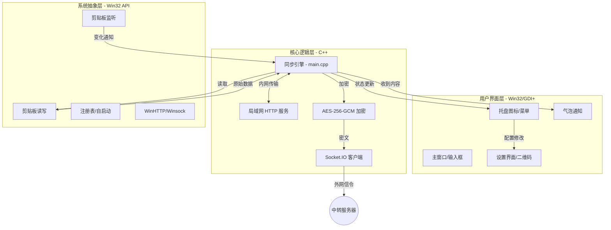

# Clipboard Push Win32 项目结构说明

本仓库包含 **Clipboard Push** 的原生 Windows 客户端实现。项目采用 C++17 编写，基于 Win32 API 和 GDI+，实现了高性能、低占用的剪贴板跨端同步功能。

---

## 📂 目录结构一览

```text
win32-client/
├── CMakeLists.txt          # 项目构建配置文件 (定义编译选项、依赖、子系统等)
├── vcpkg.json              # 依赖管理配置文件 (nlohmann-json, qrcodegen)
├── PROJECT_STRUCTURE.md    # [当前文件] 项目架构说明
└── src/
    ├── main.cpp            # 应用程序入口：消息循环、核心同步逻辑编排
    ├── core/               # 核心逻辑层 (业务无关，跨平台潜力)
    │   ├── Config          # 配置管理 (JSON 读写、自启动注册表操作)
    │   ├── Crypto          # 加密模块 (AES-256-GCM, Base64)
    │   ├── Logger          # 线程安全日志系统 (控制台 + 文件)
    │   ├── Network         # 基础网络 (WinHTTP 封装, WebSocket 客户端)
    │   ├── SocketIOService # Socket.IO 协议实现 (连接管理、信令分发)
    │   ├── LocalServer     # 局域网 HTTP 服务 (用于文件直连秒传)
    │   └── Utils           # 工具类 (DPI 感知、网络元数据提取)
    ├── platform/           # 操作系统抽象层 (Windows 特有 API 封装)
    │   ├── Platform        # 系统环境初始化 (Gdiplus, Winsock)
    │   ├── Clipboard       # 剪贴板读写 (文本、DIB图像、CF_HDROP文件)
    │   ├── ClipboardMonitor# 剪贴板硬件监听 (AddClipboardFormatListener)
    │   └── Hotkey          # 全局热键管理 (RegisterHotKey)
    ├── ui/                 # 界面层 (原生 Win32 对话框与控件)
    │   ├── MainWindow      # 主输入窗口 & 状态显示
    │   ├── SettingsWindow  # 设置中心 (包含动态 QR 码生成)
    │   ├── TrayIcon        # 系统托盘管理 (气泡通知、动态图标、右键菜单)
    │   ├── NotificationWindow # 自定义 Toast 气泡提醒
    │   └── Resource.h      # 资源 ID 定义
    └── resources/          # 静态资源
        ├── app_icon.ico    # 程序图标
        └── ...
```

---

## 🏗️ 架构逻辑图



---

## 核心组件功能详解

### 1. 核心链路 (Core)
*   **SocketIOService**: 程序的“神经中枢”。负责与中转服务器保持长连接，处理 `JoinRoom`、`room_state_changed`、`transfer_command` 等实时信令。
*   **Crypto**: 安全基石。所有剪贴板内容在离开本机前都会经过 AES-256-GCM 加密，Key 由用户 `room_key` 派生，确保端到端安全。
*   **LocalServer**: 提速利器。当发现 Peer 在同一局域网时，程序会启动一个轻量级 HTTP 服务，让手机直接从 PC 拉取文件，绕过云端带宽限制。

### 2. 系统交互 (Platform)
*   **ClipboardMonitor**: 核心触发器。利用 Windows 消息机制监听剪贴板更新，并能智能过滤掉由本程序自身引起的更新（防止无限循环）。
*   **Hotkey**: 效率工具。全局监听 `Ctrl+F6`（可配置），在不打开界面的情况下快速触发“推送当前剪贴板”动作。

### 3. 界面展示 (UI)
*   **TrayIcon**: 程序的“脸面”。右下角图标不仅提供菜单入口，还会通过 GDI+ 实时绘制**状态点**（绿/黄/红）来反馈连接质量。
*   **SettingsWindow**: 配置中心。利用 `nayuki-qr-code-generator` 实时生成包含连接元数据的 JSON 二维码，实现移动端一扫即连。

---

## 🚀 编译与发布特性
*   **静态链接 (Static Link)**: 通过 `/MT` 标志和 `x64-windows-static` 三元组，将所有运行时库打入单个 `.exe`。
*   **零依赖运行**: 编译产物无需安装 Visual C++ Redistributable，支持在纯净的 Windows 10/11 系统上开箱即用。
*   **体积极致**: 包含完整加密、网络服务器和 UI 逻辑的成品体积控制在 **1MB 以内**。
